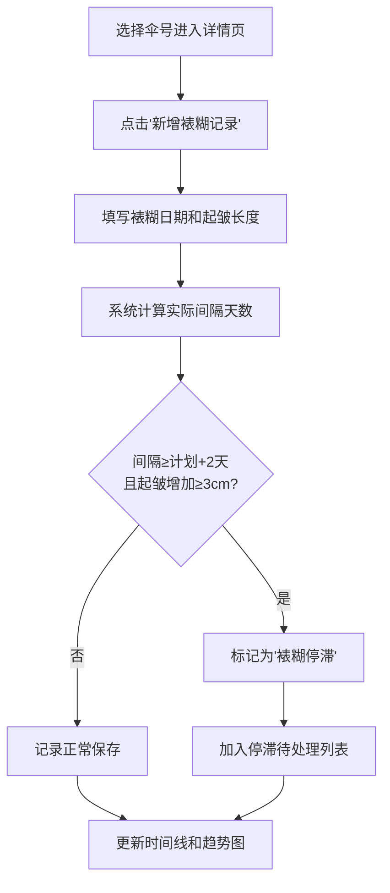
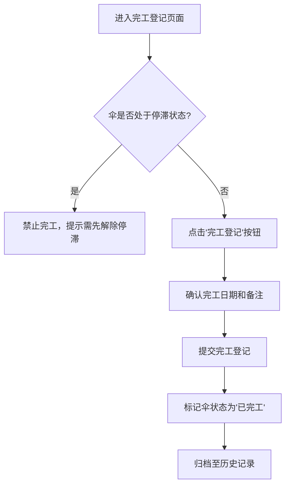
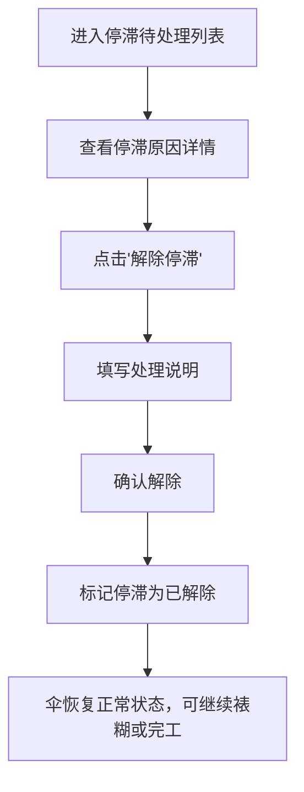

## 1. 产品概述

杭州油纸伞作坊「裱糊间隔与伞面起皱」线上台账系统，实现油纸伞从骨架到收伞的全程可追溯管理。

- 主要目的：数字化管理油纸伞裱糊工序的间隔时间与伞面起皱数据，自动识别「裱糊停滞」风险，保障成品质量
- 目标用户：作坊工匠、质量管理人员、生产调度人员
- 市场价值：传统工艺与数字化管理结合，提升品控效率，保留完整工艺数据档案

## 2. 核心功能

### 2.1 用户角色

| 角色 | 注册方式 | 核心权限 |
|------|----------|----------|
| 操作员 | 系统内置账号 | 查看伞号列表、登记裱糊记录、登记完工交付、查看时间线 |
| 管理员 | 系统内置账号 | 所有操作员权限 + 管理伞号基础信息、解除停滞状态 |

### 2.2 功能模块

1. **伞号列表页**：展示所有油纸伞的基础信息与当前状态，支持按状态筛选
2. **单伞详情页**：展示单把伞的裱糊时间线、起皱趋势图、停滞记录
3. **停滞待处理列表**：集中展示所有处于「裱糊停滞」状态的伞，支持解除停滞操作
4. **完工登记**：对非停滞状态的伞进行完工交付登记

### 2.3 页面详情

| 页面名称 | 模块名称 | 功能描述 |
|----------|----------|----------|
| 伞号列表页 | 顶部导航 | 页签切换：伞号列表、停滞待处理、完工登记 |
| 伞号列表页 | 筛选区 | 按状态筛选（全部/正常/停滞/已完工），搜索伞号 |
| 伞号列表页 | 数据卡片列表 | 展示伞号、计划间隔天数、当前状态、最近裱糊日期、操作按钮 |
| 单伞详情页 | 基本信息卡 | 伞号、计划间隔天数、创建时间、当前状态 |
| 单伞详情页 | 裱糊时间线 | 按时间倒序展示每次裱糊记录：日期、间隔天数、起皱长度、是否触发停滞 |
| 单伞详情页 | 起皱趋势图 | 折线图展示历次起皱长度变化趋势 |
| 单伞详情页 | 新增裱糊表单 | 登记本次裱糊日期和起皱长度 |
| 停滞待处理列表 | 停滞卡片列表 | 展示停滞伞号、停滞原因、停滞天数、操作按钮（解除停滞） |
| 完工登记 | 待完工列表 | 展示可完工的伞号、已完成裱糊次数、完工登记按钮 |
| 完工登记 | 完工确认弹窗 | 确认完工日期、填写备注、提交登记 |

## 3. 核心流程

### 3.1 裱糊登记流程

### 3.2 完工交付流程

### 3.3 停滞解除流程

## 4. 用户界面设计

### 4.1 设计风格

**设计理念**：中式传统美学与现代简约的融合，致敬油纸伞非遗工艺

- **主色调**：
  - 纸伞米白 `#F5F0E6`（背景基调）
  - 朱砂红 `#C41E3A`（强调色、停滞警示）
  - 竹青 `#7D8471`（辅助色、正常状态）
  - 墨黑 `#2C2C2C`（文字主色）
- **按钮风格**：圆润边角（8px），悬停时轻微上浮阴影，朱砂红用于主操作，竹青用于次要操作
- **字体**：标题使用「Noto Serif SC」衬线体体现东方韵味，正文使用「Noto Sans SC」无衬线体保证可读性
- **布局风格**：卡片式布局，留白充足，配细金线装饰体现传统工艺质感
- **图标风格**：使用 lucide-react 线性图标，搭配油纸伞、竹子、卷轴等元素的装饰性图案

### 4.2 页面设计概述

| 页面名称 | 模块名称 | UI 元素 |
|----------|----------|---------|
| 伞号列表页 | 顶部导航 | 朱砂红下划线标识当前页签，悬停有竹青色过渡动画 |
| 伞号列表页 | 卡片列表 | 米白底配细边框，状态标签用不同颜色（竹青=正常，朱砂红=停滞，灰=已完工），卡片悬停有轻微上浮和阴影加深 |
| 单伞详情页 | 时间线 | 竖线连接各节点，节点用圆形标识，停滞节点为朱砂红实心圆，正常节点为竹青空心圆 |
| 单伞详情页 | 趋势图 | SVG 手绘风格折线图，起皱上升段用朱砂红，平稳/下降段用竹青 |
| 停滞待处理列表 | 停滞卡片 | 朱砂红边框强调警示，醒目展示停滞原因和停滞天数 |
| 通用 | 表单弹窗 | 半透明米白磨砂背景，淡入动画，输入框有细金线聚焦效果 |

### 4.3 响应式设计

- **桌面优先**：默认 1280px 以上最优展示，卡片采用 3 列网格布局
- **平板适配**（768px-1279px）：卡片改为 2 列布局，侧边信息折叠为顶部信息栏
- **手机适配**（<768px）：卡片改为单列，导航改为底部 Tab 栏，时间线简化为紧凑模式
- **触摸优化**：按钮最小高度 44px，列表项增加点击反馈动画

### 4.4 动效设计

- **页面加载**：卡片错落淡入（staggered fade-in），间隔 80ms
- **状态变化**：停滞标记出现时有红光闪烁动画，完工状态变化有打钩动画
- **滚动效果**：时间线节点随滚动逐渐显现
- **悬停反馈**：按钮和可点击卡片有 0.2s 颜色过渡和轻微位移
