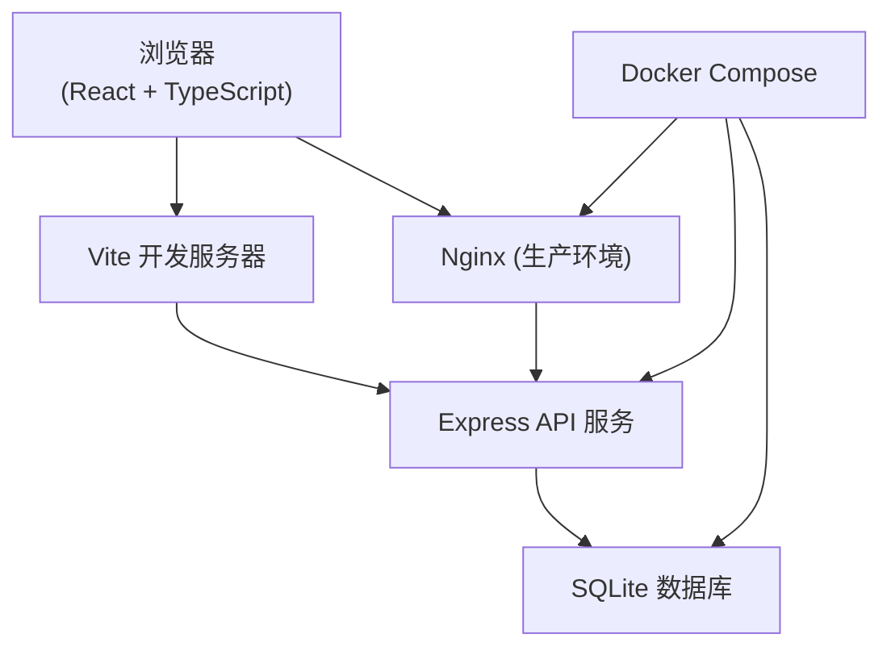
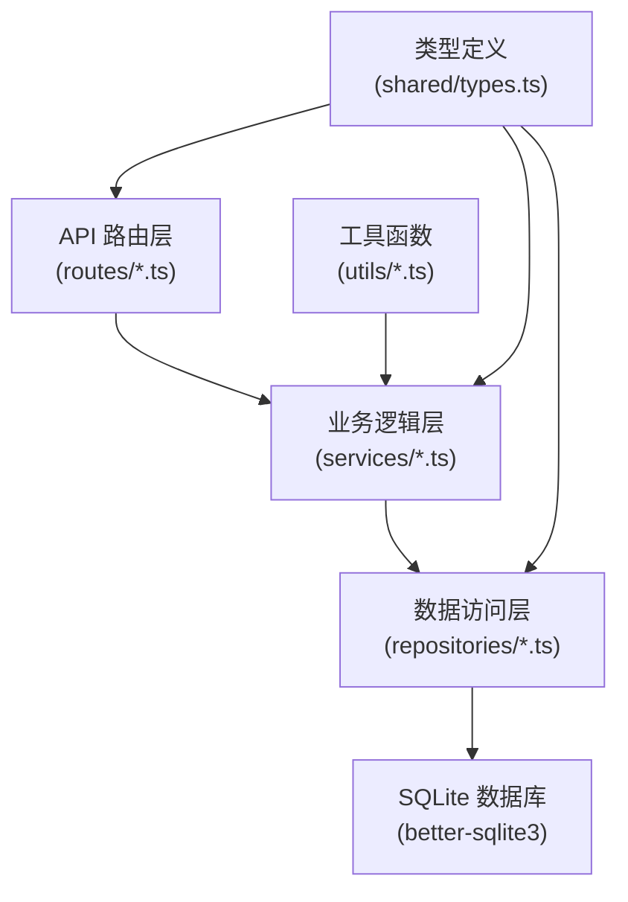
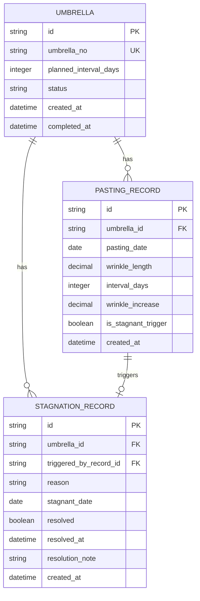

## 1. 架构设计



## 2. 技术描述

- **前端**：React@18 + TypeScript + Vite + TailwindCSS@3 + React Router DOM + Zustand + lucide-react
- **后端**：Express@4 + TypeScript + better-sqlite3
- **数据库**：SQLite（文件型数据库，便于 Docker 部署和数据迁移）
- **部署**：Docker Compose，包含前端（Nginx）、后端（Node）两个服务
- **包管理器**：pnpm

## 3. 路由定义

| 路由 | 页面 | 说明 |
|------|------|------|
| `/` | 伞号列表页 | 展示所有伞号，支持筛选搜索 |
| `/umbrella/:id` | 单伞详情页 | 裱糊时间线、趋势图、新增裱糊 |
| `/stagnation` | 停滞待处理列表 | 停滞伞号列表、解除停滞操作 |
| `/completion` | 完工登记页 | 待完工列表、完工登记操作 |

## 4. API 定义

### 4.1 TypeScript 类型定义

```typescript
// 伞的状态
type UmbrellaStatus = 'normal' | 'stagnant' | 'completed';

// 油纸伞基础信息
interface Umbrella {
  id: string;
  umbrellaNo: string;
  plannedIntervalDays: number;
  status: UmbrellaStatus;
  createdAt: string;
  completedAt: string | null;
}

// 裱糊记录
interface PastingRecord {
  id: string;
  umbrellaId: string;
  pastingDate: string;
  wrinkleLength: number;
  intervalDays: number | null;
  wrinkleIncrease: number | null;
  isStagnantTrigger: boolean;
  createdAt: string;
}

// 停滞记录
interface StagnationRecord {
  id: string;
  umbrellaId: string;
  triggeredByRecordId: string;
  reason: string;
  stagnantDate: string;
  resolved: boolean;
  resolvedAt: string | null;
  resolutionNote: string | null;
  createdAt: string;
}

// 带统计信息的伞列表项
interface UmbrellaListItem extends Umbrella {
  lastPastingDate: string | null;
  pastingCount: number;
  currentStagnation: StagnationRecord | null;
}
```

### 4.2 接口列表

| 方法 | 路径 | 说明 | 请求体 | 响应 |
|------|------|------|--------|------|
| GET | `/api/umbrellas` | 获取伞号列表 | `?status=normal&search=YS001` | `UmbrellaListItem[]` |
| GET | `/api/umbrellas/:id` | 获取单伞详情 | - | `Umbrella & { records: PastingRecord[], stagnations: StagnationRecord[] }` |
| POST | `/api/umbrellas` | 新增伞号 | `{ umbrellaNo: string, plannedIntervalDays: number }` | `Umbrella` |
| POST | `/api/umbrellas/:id/pasting` | 新增裱糊记录 | `{ pastingDate: string, wrinkleLength: number }` | `{ record: PastingRecord, stagnation?: StagnationRecord }` |
| GET | `/api/stagnations` | 获取停滞列表 | `?resolved=false` | `(StagnationRecord & { umbrella: Umbrella })[]` |
| POST | `/api/stagnations/:id/resolve` | 解除停滞 | `{ resolutionNote: string }` | `StagnationRecord` |
| POST | `/api/umbrellas/:id/complete` | 登记完工 | `{ completedDate: string, note?: string }` | `Umbrella` |

## 5. 服务端架构图



## 6. 数据模型

### 6.1 ER 图



### 6.2 DDL 语句

```sql
-- 油纸伞表
CREATE TABLE IF NOT EXISTS umbrella (
  id TEXT PRIMARY KEY,
  umbrella_no TEXT NOT NULL UNIQUE,
  planned_interval_days INTEGER NOT NULL,
  status TEXT NOT NULL DEFAULT 'normal',
  created_at DATETIME NOT NULL DEFAULT CURRENT_TIMESTAMP,
  completed_at DATETIME
);

-- 裱糊记录表
CREATE TABLE IF NOT EXISTS pasting_record (
  id TEXT PRIMARY KEY,
  umbrella_id TEXT NOT NULL,
  pasting_date DATE NOT NULL,
  wrinkle_length REAL NOT NULL,
  interval_days INTEGER,
  wrinkle_increase REAL,
  is_stagnant_trigger BOOLEAN NOT NULL DEFAULT 0,
  created_at DATETIME NOT NULL DEFAULT CURRENT_TIMESTAMP,
  FOREIGN KEY (umbrella_id) REFERENCES umbrella(id)
);

-- 停滞记录表
CREATE TABLE IF NOT EXISTS stagnation_record (
  id TEXT PRIMARY KEY,
  umbrella_id TEXT NOT NULL,
  triggered_by_record_id TEXT NOT NULL,
  reason TEXT NOT NULL,
  stagnant_date DATE NOT NULL,
  resolved BOOLEAN NOT NULL DEFAULT 0,
  resolved_at DATETIME,
  resolution_note TEXT,
  created_at DATETIME NOT NULL DEFAULT CURRENT_TIMESTAMP,
  FOREIGN KEY (umbrella_id) REFERENCES umbrella(id),
  FOREIGN KEY (triggered_by_record_id) REFERENCES pasting_record(id)
);

-- 索引
CREATE INDEX IF NOT EXISTS idx_pasting_record_umbrella ON pasting_record(umbrella_id);
CREATE INDEX IF NOT EXISTS idx_stagnation_record_umbrella ON stagnation_record(umbrella_id);
CREATE INDEX IF NOT EXISTS idx_stagnation_record_resolved ON stagnation_record(resolved);
CREATE INDEX IF NOT EXISTS idx_umbrella_status ON umbrella(status);
```

### 6.3 初始演示数据

```sql
-- 插入演示伞号
INSERT INTO umbrella (id, umbrella_no, planned_interval_days, status, created_at) VALUES
  ('u001', 'YS-2026-001', 5, 'normal', '2026-05-15 09:00:00'),
  ('u002', 'YS-2026-002', 7, 'stagnant', '2026-05-16 10:30:00'),
  ('u003', 'YS-2026-003', 5, 'normal', '2026-05-18 08:15:00'),
  ('u004', 'YS-2026-004', 6, 'completed', '2026-05-10 14:00:00'),
  ('u005', 'YS-2026-005', 5, 'normal', '2026-05-20 11:20:00'),
  ('u006', 'YS-2026-006', 7, 'stagnant', '2026-05-12 13:45:00');

-- 插入裱糊记录
INSERT INTO pasting_record (id, umbrella_id, pasting_date, wrinkle_length, interval_days, wrinkle_increase, is_stagnant_trigger) VALUES
  -- YS-2026-001: 正常流程
  ('p001', 'u001', '2026-05-16', 0.5, NULL, NULL, 0),
  ('p002', 'u001', '2026-05-21', 1.2, 5, 0.7, 0),
  ('p003', 'u001', '2026-05-26', 1.8, 5, 0.6, 0),
  ('p004', 'u001', '2026-05-31', 2.1, 5, 0.3, 0),
  
  -- YS-2026-002: 触发停滞
  ('p005', 'u002', '2026-05-17', 0.8, NULL, NULL, 0),
  ('p006', 'u002', '2026-05-24', 1.5, 7, 0.7, 0),
  ('p007', 'u002', '2026-06-02', 4.8, 9, 3.3, 1),
  
  -- YS-2026-003: 正常流程
  ('p008', 'u003', '2026-05-19', 0.3, NULL, NULL, 0),
  ('p009', 'u003', '2026-05-24', 0.9, 5, 0.6, 0),
  ('p010', 'u003', '2026-05-29', 1.4, 5, 0.5, 0),
  
  -- YS-2026-004: 已完工
  ('p011', 'u004', '2026-05-11', 0.4, NULL, NULL, 0),
  ('p012', 'u004', '2026-05-17', 1.0, 6, 0.6, 0),
  ('p013', 'u004', '2026-05-23', 1.6, 6, 0.6, 0),
  ('p014', 'u004', '2026-05-29', 2.0, 6, 0.4, 0),
  
  -- YS-2026-005: 刚开始
  ('p015', 'u005', '2026-05-21', 0.2, NULL, NULL, 0),
  ('p016', 'u005', '2026-05-26', 0.7, 5, 0.5, 0),
  
  -- YS-2026-006: 触发停滞
  ('p017', 'u006', '2026-05-13', 0.6, NULL, NULL, 0),
  ('p018', 'u006', '2026-05-20', 1.3, 7, 0.7, 0),
  ('p019', 'u006', '2026-05-30', 4.5, 10, 3.2, 1);

-- 插入停滞记录
INSERT INTO stagnation_record (id, umbrella_id, triggered_by_record_id, reason, stagnant_date, resolved) VALUES
  ('s001', 'u002', 'p007', '实际间隔9天超出计划7天+2天，起皱增加3.3cm超出3cm阈值', '2026-06-02', 0),
  ('s002', 'u006', 'p019', '实际间隔10天超出计划7天+2天，起皱增加3.2cm超出3cm阈值', '2026-05-30', 0);

-- 更新已完工伞的完工日期
UPDATE umbrella SET completed_at = '2026-06-01 15:30:00', status = 'completed' WHERE id = 'u004';

-- 更新停滞伞的状态
UPDATE umbrella SET status = 'stagnant' WHERE id IN ('u002', 'u006');
```
